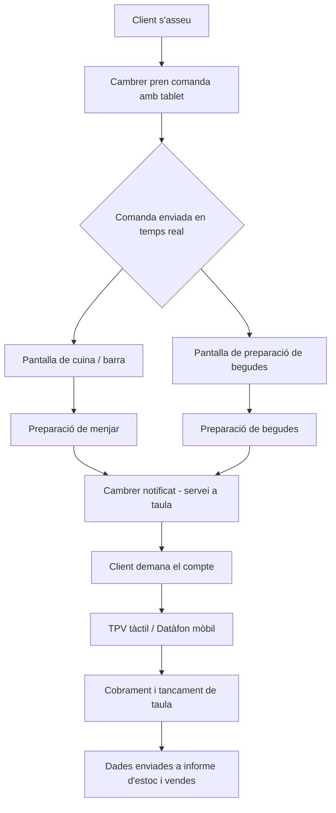
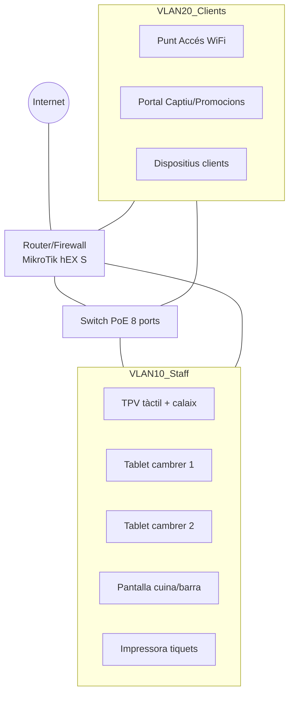

# Pla de Transformació Digital – “El Racó del Cafè”

## 1. Anàlisi de l’estat actual i necessitats detectades

**Situació actual (AS-IS)**
- El cambrer apunta les comandes a mà en un bloc.
- El paper es trasllada a cuina, cosa que genera retards, errors d’interpretació i pèrdues de comandes.
- El tancament de caixa és manual amb una caixa registradora bàsica.
- No hi ha control d’estoc ni estadístiques de vendes per franja horària.
- No s’ofereix WiFi als clients o es fa de manera insegura, compartint la mateixa xarxa que el TPV.

**Necessitats principals**
1. **Agilitat en la presa de comandes i servei** – eliminar el paper i comunicar a cuina en temps real.
2. **Control de negoci** – conèixer estoc, productes més venuts i hores punta.
3. **Xarxa segmentada i segura** – separar el trànsit de negoci del trànsit dels clients, oferint WiFi amb portal captiu.
4. **Infraestructura TPV moderna i resistent** – adequada a entorn de cafeteria (líquids, calor).
5. **Solució informàtica amb cost equilibrat** – avaluació opcions lliures i comercials.

## 2. Objectius de la transformació digital

- Digitalitzar tot el cicle de la comanda (presa → cuina → cobrament) per reduir temps d’espera i errors.
- Obtenir dades en temps real d’estoc i vendes per optimitzar compres i horaris.
- Dotar el local d’una xarxa professional amb alt rendiment i segmentació d’usuaris.
- Garantir la continuïtat del servei fins i tot en caigudes d’Internet.
- Mantenir el pressupost dins uns límits raonables per a una pime de restauració.

## 3. Mapa de Processos (TO-BE)

**Descripció del flux:**
1. El cambrer pren la comanda en una tauleta amb app de TPV, seleccionant taula i productes.
2. La comanda es divideix automàticament: plats a la pantalla de cuina, begudes a la pantalla de barra.
3. Quan l’ítem està llest, el personal de cuina/barra marca la comanda com a completada. El cambrer rep un avís per servir.
4. En sol·licitar el compte, el cambrer imprimeix el tiquet o presenta un datàfon mòbil per pagar, tot registrat al TPV central.
5. L’estoc s’actualitza automàticament i les dades de venda nodreixen els informes del propietari.

## 4. Disseny de la Xarxa

Es proposa una infraestructura amb segmentació lògica de xarxa mitjançant VLANs per separar trànsit crític (TPV, datàfons, impressores) del trànsit de clients.

**Característiques clau:**
- **VLAN 10 (Staff)**: accés aïllat, sense visibilitat des de la xarxa de clients. Trànsit del TPV, tauletes i pantalla de cuina encapsulat i prioritzat (QoS).
- **VLAN 20 (Clients)**: xarxa separada amb sortida a Internet a través d’un portal captiu. Els usuaris accepten condicions d’ús i veuen una promoció abans de navegar.
- El router proporciona DHCP segregat, regles de tallafoc entre VLANs i capacitat de VPN per a telegestió.
- El switch PoE alimenta el punt d’accés i les pantalles de cuina, evitant fonts d’alimentació addicionals.

## 5. Pressupost de Hardware

| Concepte | Model proposat | Unitats | Preu unitari (€) | Total (€) |
|----------|----------------|---------|------------------|-----------|
| TPV tàctil (impermeable) | Imin Palmsize J1900 15,6″ tàctil (IP65 frontal) | 1 | 520,00 | 520,00 |
| Calaix portamonedes | Calaix metàl·lic amb interfície RJ11 | 1 | 35,00 | 35,00 |
| Impressora tèrmica de cuina/barra | Epson TM-T20III LAN | 1 | 190,00 | 190,00 |
| Tauleta per a cambrers (2 unitats) | Samsung Galaxy Tab A8 8.7″ Wi-Fi | 2 | 160,00 | 320,00 |
| Router/Firewall professional | MikroTik hEX S (RB760iGS) | 1 | 65,00 | 65,00 |
| Punt d’accés WiFi empresarial | TP-Link EAP225 (AC1350) | 1 | 60,00 | 60,00 |
| Switch PoE | TP-Link TL-SG108PE (8 ports PoE) | 1 | 65,00 | 65,00 |
| Cablejat de xarxa i safata | Cable UTP Cat.6, canaletes, connectors | - | 50,00 | 50,00 |
| SAI (protecció elèctrica) | APC Back-UPS 500VA | 1 | 80,00 | 80,00 |
| **TOTAL** | | | | **1.385,00 €** |

*Preus orientatius actualitzats a maig de 2026, IVA inclòs.*
*La impressora tèrmica serveix com a còpia de seguretat física de les comandes i pot funcionar també com a impressora de tiquets si el client prefereix paper al pagament.*

## 6. Informe de Software: Comparativa Lliure vs Comercial

### Opció A: Programari Lliure – Floreant POS + Odoo Community

- **TPV**: Floreant POS (gratuït, instal·lació en servidor local Linux o dins del TPV).
- **Gestió d’estoc i informes**: Mòdul Odoo Community “Punt de Venda” i “Inventari” autogestionat.
- **Suport**: contractació d’un tècnic per a la instal·lació i formació (cost únic de 600-800 €). Manteniment esporàdic.

**Costos estimats:**

| Concepte | Any 1 (€) | Anys 2-3 (€/any) | Total 3 anys (€) |
|----------|-----------|-------------------|-------------------|
| Instal·lació i formació (tècnic extern) | 700 | 0 | 700 |
| Allotjament servidor cloud (VPS bàsic) | 180 | 180 | 540 |
| Actualitzacions i suport bàsic (borsa d’hores) | 150 | 100 | 350 |
| **Total** | **1.030** | **280** | **1.590** |

### Opció B: Programari Comercial – Revo (o similar, p.e. Square)

- Subscripció mensual amb TPV, gestió d’inventari, informes avançats i suport 24/7.
- Inclou app mòbil per a cambrers i panell de cuina opcional.
- Quotes típiques: 45 €/mes per terminal + 10 €/mes per tauleta addicional (2 tauletes). Total mensual: 55 €/mes.

**Costos estimats:**

| Concepte | Any 1 (€) | Anys 2-3 (€/any) | Total 3 anys (€) |
|----------|-----------|-------------------|-------------------|
| Quotes de llicències (55 €/mes) | 660 | 660 | 1.980 |
| Comissions per transaccions (si paga integrat) | 0 (inclòs) | 0 | 0 |
| Suport i actualitzacions | inclòs | inclòs | 0 |
| **Total** | **660** | **660** | **1.980** |

### Comparativa econòmica resumida

| Ítem | Programari Lliure | Programari Comercial |
|------|-------------------|----------------------|
| Inversió 1r any | 1.030 € | 660 € |
| Total 3 anys | 1.590 € | 1.980 € |
| Cost mitjà mensual (3 anys) | ~44 € | ~55 € |
| Avantatges | Independència, sense quotes recurrents, adaptable | Suport directe, actualitzacions automàtiques, implementació ràpida |
| Inconvenients | Dependència d’un tècnic per a canvis, corba d’aprenentatge | Cost recurrent elevat, dependència del proveïdor |

**Recomanació:**  
Per a una cafeteria que vol minimitzar costos a mitjà termini i té capacitat de contractar suport puntual, l’opció **Floreant POS + Odoo Community** és més rendible a partir del segon any. Si el propietari vol una solució immediata sense preocupar-se per la tecnologia, Revo ofereix més comoditat. Proposem començar amb la solució lliure, ja que l’estalvi en 3 anys és de gairebé 400 € i la inversió es pot amortitzar en hardware.

## 7. Pla de Contingència

**Objectiu:** Assegurar que la cafeteria pugui continuar operant i cobrant encara que falli Internet o la xarxa WiFi.

### Escenaris de fallada i resposta

| Fallada | Impacte | Mesura de contingència |
|---------|---------|------------------------|
| Caiguda d’Internet | Pèrdua de sincronització al núvol, accés a informes remots, portal captiu | - TPV i tauletes operen en mode “offline” local, emmagatzemant transaccions al servidor intern (TPV central). - En recuperar Internet, les dades es sincronitzen automàticament. |
| Caiguda del WiFi intern (AP) | Tauletes dels cambrers sense connexió | - Canvi automàtic a la presa de comandes des del TPV central tàctil (pantalla principal). - Es pot imprimir un tiquet manual i portar-lo a cuina. |
| Fallada elèctrica (tall de llum) | Apagada total d’equips | - SAI manté TPV, router i impressora durant almenys 30 minuts. - Bloc de comandes en paper com a última alternativa, amb còpia manual al sistema quan es recuperi la llum. |
| Error del programari TPV | Impossible registrar vendes digitals | - Es manté una còpia de l’última versió del sistema en un disc USB autoarrencable. - Es pot restablir el TPV des d’una imatge de recuperació en menys de 15 minuts. |
| Caiguda del sistema de pantalla de cuina | Cuina no rep comandes digitals | - La impressora tèrmica de cuina actua com a backup immediat: les comandes s’imprimeixen automàticament. - El personal pot trucar per megafonia si és necessari. |

**Mesures preventives recomanades:**
- Revisió diària de l’estat del SAI i del punt d’accés.
- Formació del personal en el procés manual de contingència (un cop al trimestre).
- Configurar alertes automàtiques al router per notificar caigudes de connexió al propietari.

## 8. Conclusions i viabilitat

La transformació proposada suposa un salt qualitatiu per a “El Racó del Cafè” sense un cost desorbitat. La inversió total en hardware (1.385 €) i el cost del programari (uns 1.030 € el primer any en l’opció lliure) s’amortitzen ràpidament gràcies a:

- Reducció d’errors de comanda.
- Major velocitat de servei, que incrementa la rotació de taules.
- Control d’estoc que evita malbarataments i millora la compra.
- Millora de l’experiència del client amb WiFi de qualitat.

El projecte es considera tècnicament viable, econòmicament assumible i alineat amb els principis de sostenibilitat (menys paper, equips eficients energèticament i reutilització de servidors de baix consum). Amb el pla de contingència definit, el negoci pot sentir-se segur davant de qualsevol imprevist tecnològic.

---

*Document elaborat per l’equip de consultoria digital – Projecte Connecta’t al Futur.*
