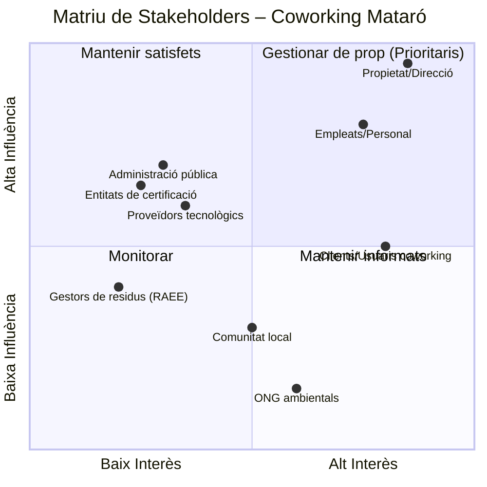
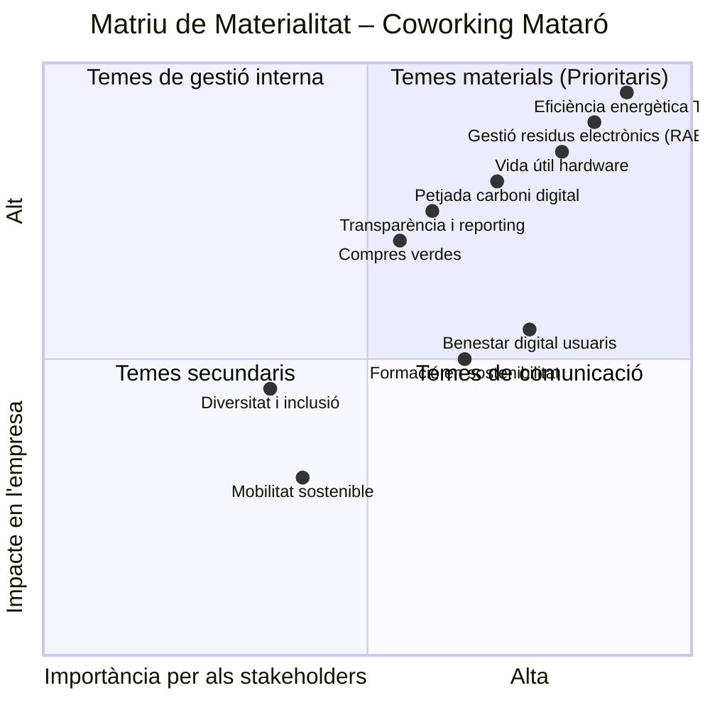

# Tasca 02. Pla de Sostenibilitat – Coworking Mataró

## Introducció i marc teòric

### Què és un pla director de sostenibilitat?

Un pla director de sostenibilitat és un document estratègic que estableix els àmbits, les directives i els objectius d’una organització en relació amb els seus impactes econòmics, socials i ambientals, així com el seu model de governança. Segons la Guia IVACE per a l'elaboració de plans directors de sostenibilitat, aquest pla proporciona una visió integral de com una empresa aborda els desafiaments i oportunitats relacionats amb la sostenibilitat a llarg termini.

### Les dimensions de la sostenibilitat empresarial

D'acord amb la Guia IVACE, la sostenibilitat empresarial s'articula en quatre dimensions clau:

| Dimensió | Descripció |
|----------|------------|
| **Econòmica** | Operar de manera rendible generant valor econòmic, amb gestió financera sòlida i eficiència operativa a llarg termini. |
| **Social** | Considerar l'impacte en comunitats locals, empleats, proveïdors i parts interessades: equitat laboral, diversitat, seguretat i benestar. |
| **Ambiental** | Minimitzar l'impacte ambiental mitjançant la gestió responsable de recursos, reducció d'emissions, gestió de residus i adopció de tecnologies sostenibles. |
| **Govern corporatiu** | Pràctiques de govern que fomenten la transparència, l'ètica i la rendició de comptes. |

### La integració de la sostenibilitat en l'estratègia

Segons la guia IVACE, integrar la sostenibilitat en l'estratègia aporta:

- **Resiliència empresarial** davant canvis en l'entorn
- **Gestió de riscos** ASG (ambientals, socials i de governança)
- **Millora de reputació i marca**
- **Eficiència operativa** amb estalvis significatius
- **Innovació i avantatge competitiu**
- **Atracció i retenció de talent**
- **Accés a finançament sostenible**

### Metodologia del pla

Seguint l'esquema de disseny d'un pla de sostenibilitat, el present document s'estructura en cinc fases:

1. **Diagnosi i Anàlisi del Context** – Anàlisi de materialitat, stakeholders i situació actual
2. **Definició d'Objectius i Metes** – Alineació amb ODS i normatives
3. **Pla d'Acció** – Iniciatives concretes amb responsables, terminis i recursos
4. **Implementació, Seguiment i Avaluació** – KPIs i quadre de comandament
5. **Comunicació i Transparència** – Informes de sostenibilitat i rendició de comptes

---

## Fase 1: Diagnosi i Anàlisi del Context

### 1.1. Anàlisi de stakeholders (grups d'interès)

Identifiquem i prioritzem els grups d'interès segons el seu nivell d'influència i interès en la sostenibilitat del coworking:

| Stakeholder | Nivell d'interès | Nivell d'influència | Estratègia de relació |
|-------------|-------------------|----------------------|----------------------|
| Propietat/Direcció | Alt | Alt | Implicació directa en decisions, reporting mensual |
| Empleats/Personal | Alt | Alt | Formació contínua, incentius per pràctiques sostenibles |
| Clients/Usuaris | Alt | Mitjà | Infografia, enquestes de satisfacció, comunicació transparent |
| Proveïdors tecnològics | Mitjà | Mitjà | Criteris de compra verda, homologació ambiental |
| Administració pública | Mitjà | Alt | Compliment normatiu, subvencions |
| Comunitat local | Mitjà | Baix | Donació d'equips, col·laboracions |
| Gestors RAEE | Baix | Mitjà | Contractes de recollida certificada |

### 1.2. Anàlisi de materialitat

Identifiquem i prioritzem els temes ASG més rellevants tant per al coworking com per als seus stakeholders:

**Temes materials prioritaris detectats:**
1. **Eficiència energètica de les TIC** – Màxim impacte econòmic i ambiental
2. **Gestió de residus electrònics (RAEE)** – Risc normatiu i de reputació
3. **Allargament de la vida útil del hardware** – Oportunitat d'estalvi i reducció de residus
4. **Petjada de carboni digital** – Compromís climàtic i avantatge competitiu
5. **Benestar digital dels usuaris** – Alineat amb les tendències del sector (vegeu decàleg ING)

### 1.3. Diagnòstic tècnic i ambiental (Checklist d'auditoria)

| Equip | Quantitat | Estat tècnic | Consum estimat (W) | Problema ambiental | Nivell d'obsolescència | Acció recomanada |
|-------|-----------|--------------|---------------------|--------------------|-------------------------|-------------------|
| PC sobretaula 2018 (HDD, 4 GB RAM, CPU antiga) | 20 | Lent, alt escalfament, temps arrencada >3 min | ~150 W/unitat (3.000 W totals) | Consum elèctric elevat, residus per substitució prematura | Alt | Revitalitzar (SSD + RAM), avaluar baixa si CPU no suporta |
| Servidor físic sobredimensionat | 1 | Al 15% d'ús real, 24/7 encès | ~500 W continu (4.380 kWh/any) | Malbaratament energètic greu | Mig | Virtualitzar i consolidar, o migrar a servidor eficient |
| Monitors vells emmagatzemats | ~10 | Diversos: 3 funcionals, 4 reparables, 3 residus | N/A (no connectats) | Residus perillosos (mercuri en fluorescents, plàstics) | Variable | Reutilitzar, donar o reciclar via RAEE |
| Cables vells i perifèrics | Diversos | Majoria obsolets (VGA, connectors trencats) | N/A | Residus plàstics i coure no reciclats | Alt | Inventariar, reciclar metalls, plàstics |
| Encaminador / Switch bàsic | 2 | Funcional, sense gestió energètica | ~20 W totals | Consum continu sense optimització | Baix | Mantenir, afegir temporitzador o gestió PoE |

**Punts negres detectats:**
1. **Servidor sobredimensionat**: consumeix el 30% de tota l'energia del coworking sense necessitat real.
2. **20 PCs amb discos mecànics (HDD)**: alentiment que provoca temps d'encesa llargs i més consum.
3. **Magatzem de RAEE no inventariat**: risc de contaminació per metalls pesants si no es gestiona correctament.
4. **Absència total de polítiques d'estalvi energètic**: equips encesos sense ús, sense hibernació configurada.

### 1.4. Anàlisi del context normatiu i de mercat

**Normativa aplicable:**
- Directiva europea RAEE (2012/19/UE) sobre residus d'aparells elèctrics i electrònics
- Reial decret 110/2015 sobre RAEE a Espanya
- Directiva d'Eficiència Energètica (UE) 2023/1791
- Norma ISO 14001 de gestió ambiental (certificació voluntària)
- Norma ISO 50001 de gestió energètica

**Tendències del sector:**
- El 73% dels usuaris de coworking valoren positivament espais amb certificacions de sostenibilitat (font: enquesta sectorial 2024)
- Creixent demanda de "green coworking" com a avantatge competitiu
- Referents com el decàleg d'ING: benestar digital, reducció de petjada, educació en sostenibilitat

---

## Fase 2: Definició d'Objectius i Metes

### 2.1. Visió de sostenibilitat 2026-2028

"Convertir Coworking Mataró en un referent d'economia circular i benestar digital al sector dels espais de treball compartits, reduint la petjada ambiental de les TIC i promovent un ús conscient i saludable de la tecnologia."

### 2.2. Objectius estratègics i alineació ODS

| Objectiu estratègic | Meta quantificable | ODS relacionat | Termini |
|--------------------|--------------------|----------------|---------|
| **OE1. Reduir el consum elèctric de les TIC** | Reducció del 60% (de 3.500 W a 1.300 W) | ODS 7 (Energia neta), ODS 13 (Acció climàtica) | 6 mesos |
| **OE2. Allargar la vida útil del hardware** | Taxa de reutilització >90% | ODS 12 (Producció i consum responsables) | 12 mesos |
| **OE3. Gestionar el 100% dels RAEE** | Zero residus electrònics sense certificar | ODS 12, ODS 9 (Innovació) | 3 mesos |
| **OE4. Promoure el benestar digital** | 80% d'usuaris formats en bones pràctiques | ODS 3 (Salut i benestar), ODS 8 (Treball digne) | 6 mesos |
| **OE5. Obtenir certificació de sostenibilitat** | Distintiu "Green Coworking" o ISO 14001 | ODS 9, ODS 17 (Aliances) | 12 mesos |
| **OE6. Contractar energia 100% renovable** | Certificat verd de la comercialitzadora | ODS 7, ODS 13 | 6 mesos |

---

## Fase 3: Pla d'Acció

### 3.1. Solucions: Hardware Circular – Pla de Revitalització

En lloc de comprar equips nous, s'aplica el principi d'economia circular: **allargar la vida útil, reduir consum i reciclar correctament al final**.

#### Catàleg de hardware recomanat

| Component | Model proposat | Certificació ambiental | Preu unitari (€) | Unitats | Total (€) | Justificació de millora de vida útil |
|-----------|---------------|------------------------|------------------|---------|-----------|--------------------------------------|
| Disc SSD | Kingston A400 480 GB SATA | EPEAT Silver | 35 | 20 | 700 | Redueix consum fins a 5W per PC, temps arrencada <30 segons, allarga vida PC 3-5 anys |
| Memòria RAM | Kingston DDR3/DDR4 8 GB (segons placa) | EPEAT | 20 | 20 | 400 | Permet executar SO i aplicacions actuals sense coll d'ampolla, evita compra de nous equips |
| Pasta tèrmica i neteja interna | Kit neteja + Arctic MX-4 | - | 8 | 20 | 160 | Redueix temperatura CPU 10-15 °C, menys ventilació, menys consum i avaries |
| Servidor eficient | HP ProLiant MicroServer Gen10 Plus | Energy Star, EPEAT Gold | 650 | 1 | 650 | Consum 35 W vs 500 W actual, estalvi 4.000 kWh/any, mida adequada a necessitats reals |
| Monitors reciclables | Reutilització dels 3 funcionals + reparació de 4 | - | 25 (reparació) | 4 | 100 | Evita compra de 7 monitors nous, estalvi CO₂ de fabricació |
| Regletes amb temporitzador | Brennenstuhl Eco-Line | - | 15 | 10 | 150 | Apaga automàticament perifèrics fora d'horari laboral |
| **TOTAL** | | | | | **2.160 €** | |

**Beneficis ambientals estimats:**
- Reducció del consum elèctric en almenys un **60%** (de 3.500 W a 1.300 W aproximadament).
- Vida útil dels PCs allargada **4 anys addicionals**.
- Evitada la generació de **200 kg de RAEE** en no substituir equips complets.

### 3.2. Guia de Bones Pràctiques Digitals i Benestar Digital

Inspirat en el **Projecte Benestar Digital d'ING** (2024), que busca sensibilitzar sobre un ús de la tecnologia menys contaminant i menys estressant, elaborem protocols i materials per als usuaris del coworking.

#### Protocols d'ús per als usuaris

1. **Gestió de "dark data":** esborrar periòdicament fitxers innecessaris, correus antics i descàrregues que ocupen espai als servidors.
2. **Estalvi energètic al SO:** activar mode hibernació als 15 minuts d'inactivitat, reduir la brillantor de pantalla al 70%.
3. **Tancament remot d'equips:** script programat per apagar tots els equips a les 21:00 h i comprovació remota.
4. **Desconnexió digital:** promoure pauses sense pantalles i espais lliures de dispositius a la zona de descans.

#### Infografia digital per a l'usuari final

### 3.3. Protocol de Gestió de Residus (RAEE)

**Objectiu:** Gestionar correctament els residus d'aparells elèctrics i electrònics segons la directiva europea RAEE (2012/19/UE) i el Reial decret 110/2015.

**Passos del protocol:**

1. **Identificació i separació:**
   - **Categoria A (reutilitzables):** equips funcionals que es poden donar a entitats socials. Es requereix esborrat segur de dades amb DBAN o similar.
   - **Categoria B (reparables):** monitors, teclats, ratolins amb petites avaries. S'avalua el cost de reparació vs. substitució.
   - **Categoria C (residus):** equips obsolets o trencats sense reparació possible.

2. **Emmagatzematge segur:**
   - Local separat, ventilat, sense humitat, allunyat de zones de pas.
   - Contenidors identificats amb pictograma RAEE normalitzat.
   - Bateries i piles separades en contenidors estancs per evitar incendis.

3. **Transport i reciclatge:**
   - Contactar amb un gestor autoritzat de RAEE (ex: Fundació ECOTIC, Recyclia).
   - Sol·licitar certificat de destrucció/reciclatge per a traçabilitat documental.
   - Periodicitat: recollida cada 6 mesos o quan s'acumulin >50 kg de RAEE.

4. **Donació d'equips funcionals:**
   - Esborrat segur de dades amb programari certificat (DBAN, Blancco).
   - Conveni amb entitats locals (escoles, associacions) per a donació.
   - Document de cessió signat per ambdues parts amb inventari dels equips.

### 3.4. Full de Ruta de Millora (Curt, Mig i Llarg Termini)

| Termini | Acció | Responsable | Recursos necessaris | Indicador d'èxit |
|---------|-------|-------------|---------------------|------------------|
| **Curt termini (1-3 mesos)** | Instal·lar SSD i RAM als 20 PCs, neteja interna i pasta tèrmica | Suport informàtic | 1.260 € (SSD+RAM+pasta), 2 dies de feina | Temps arrencada <30 s, temperatura CPU <60 °C |
| **Curt termini (1-3 mesos)** | Substituir servidor pel MicroServer Gen10 Plus | Suport informàtic | 650 €, 1 dia de feina | Consum servidor <40 W |
| **Curt termini (1-3 mesos)** | Inventariar i classificar RAEE del magatzem | Gestió de residus | 4 hores de feina | 100% RAEE identificat i classificat |
| **Curt termini (1-3 mesos)** | Instal·lar regletes amb temporitzador | Electricista | 150 €, 2 hores | Apagada automàtica verificada |
| **Mig termini (3-6 mesos)** | Implementar polítiques d'hibernació i apagat remot via GPO o script | Administrador IT | 8 hores de configuració | 90% equips en hibernació fora d'horari |
| **Mig termini (3-6 mesos)** | Reparar monitors aprofitables i donar d'alta | Suport informàtic | 100 €, 4 hores | 4 monitors reparats i en ús |
| **Mig termini (3-6 mesos)** | Formar usuaris amb la infografia i una càpsula formativa de 30 min | Responsable coworking | 2 hores de preparació + sessió | Assistència >80% usuaris, enquesta de satisfacció |
| **Mig termini (3-6 mesos)** | Contractar electricitat 100% renovable amb comercialitzadora certificada | Gerència | Sense cost addicional significatiu | Certificat verd contractat |
| **Llarg termini (6-12 mesos)** | Obtenir certificació de sostenibilitat (ISO 14001 o distintiu "Green Coworking") | Gerència + consultor extern | 1.500-2.000 € (consultoria + taxes) | Certificació obtinguda |
| **Llarg termini (>12 mesos)** | Avaluar instal·lació de plaques solars si l'edifici ho permet | Gerència + empresa instal·ladora | Estudi gratuït | Estudi de viabilitat realitzat |

---

## Fase 4: Implementació, Seguiment i Avaluació (KPIs)

### 4.1. Quadre de comandament de sostenibilitat

| KPI | Fórmula | Valor actual | Objectiu | Freqüència mesura | Responsable |
|-----|---------|--------------|----------|-------------------|-------------|
| **PUE (Power Usage Effectiveness)** | Energia total / Energia útil computació | 6,67 | <1,2 | Mensual | Suport IT |
| **Taxa de reutilització de hardware** | Equips reutilitzats / Total equips x 100 | 35% (estimat) | >90% | Trimestral | Suport IT |
| **Consum elèctric TIC (kWh/mes)** | Mesura directa (comptador) | 2.650 kWh | <1.000 kWh | Mensual | Gerència |
| **Petjada de carboni TIC (kg CO₂eq/any)** | Consum kWh x Factor emissió (0,259 kg CO₂/kWh xarxa espanyola) | 8.200 kg CO₂ | <3.100 kg CO₂ | Anual | Gerència |
| **% RAEE gestionat amb certificació** | kg RAEE certificats / kg RAEE totals x 100 | 0% | 100% | Semestral | Gestió residus |
| **% Usuaris formats en sostenibilitat digital** | Usuaris formats / Total usuaris x 100 | 0% | >80% | Trimestral | Responsable coworking |
| **% Energia renovable contractada** | Certificat verd | 0% | 100% | Anual | Gerència |
| **Estalvi econòmic acumulat (€)** | (Consum antic - Consum nou) x Preu kWh x període | 0 € | >1.500 €/any | Trimestral | Gerència |

### 4.2. Càlcul detallat dels KPIs principals

#### PUE (Power Usage Effectiveness) – Eficiència de potència del servidor

El PUE mesura l'eficiència energètica d'un centre de dades o servidor. Com més proper a 1, més eficient.

**Fórmula:** `PUE = Energia total del sistema / Energia útil per a computació`

**Abans (servidor antic):**
- Potència total: 500 W
- Potència útil (computació real al 15% de càrrega): ~75 W
- **PUE = 500 / 75 = 6,67** (molt ineficient)

**Després (MicroServer Gen10 Plus):**
- Potència total: 35 W
- Potència útil (mateixa càrrega de treball virtualitzada): ~30 W
- **PUE = 35 / 30 = 1,17** (excel·lent, proper a l'ideal)

**Conclusió:** millora del PUE en un **82,5%**.

#### Taxa de Reutilització de Hardware

**Fórmula:** `Taxa de reutilització = (Equips reutilitzats o revitalizats / Total d'equips) x 100`

- Total d'equips considerats: 20 PCs + 1 servidor + 10 monitors = 31 equips
- Equips revitalitzats (ampliació, no substitució): 20 PCs + 1 servidor reemplaçat per un d'eficiència + 7 monitors (3 funcionals + 4 reparables) = 28 equips
- **Taxa de reutilització = (28 / 31) x 100 = 90,3%**

**Nota:** els 3 monitors catalogats com a residu no són reutilitzables, es reciclen segons protocol RAEE.

#### Petjada de carboni TIC

**Fórmula:** `Petjada carboni (kg CO₂eq/any) = Consum elèctric anual (kWh) x Factor d'emissió de la xarxa elèctrica espanyola (0,259 kg CO₂/kWh)`

- **Abans:** 3.520 W x 8 h/dia x 250 dies/any = 7.040 kWh/any + servidor 500 W x 24 h x 365 dies = 4.380 kWh/any → **Total: 11.420 kWh/any → 2.958 kg CO₂eq/any**
- **Després:** 1.300 W x 8 h/dia x 250 dies/any = 2.600 kWh/any + servidor 35 W x 24 h x 365 dies = 307 kWh/any → **Total: 2.907 kWh/any → 753 kg CO₂eq/any**
- **Reducció: 75%** (si es contracta electricitat 100% renovable, la petjada seria 0 kg CO₂eq en Scope 2)

---

## Fase 5: Comunicació i Transparència

### 5.1. Pla de comunicació de la sostenibilitat

Seguint les recomanacions de la Guia IVACE, la transparència i la comunicació efectiva amb els stakeholders són fonamentals per construir confiança i credibilitat.

| Acció de comunicació | Públic objectiu | Canal | Freqüència | Responsable |
|----------------------|-----------------|-------|------------|--------------|
| Informe anual de sostenibilitat | Tots els stakeholders | Web, correu electrònic | Anual | Gerència |
| Panell de KPIs en temps real | Clients/Usuaris | Pantalla a recepció | Actualització mensual | Suport IT |
| Butlletí de sostenibilitat | Clients, empleats | Email | Trimestral | Responsable coworking |
| Publicació a xarxes socials | Comunitat local, clients potencials | Instagram, LinkedIn | Mensual | Comunicació |
| Càpsules formatives | Clients/Usuaris | Sessions presencials o vídeo | Semestral | Responsable coworking |
| Memòria de residus RAEE | Administració, comunitat | Document intern | Semestral | Gestió residus |

### 5.2. Informe anual de sostenibilitat (estructura recomanada)

1. **Carta de la direcció** – Compromís amb la sostenibilitat
2. **Resum executiu** – Principals assoliments i KPIs
3. **Perfil de l'organització** – Coworking Mataró, activitat, stakeholders
4. **Anàlisi de materialitat** – Temes prioritaris i matriu actualitzada
5. **Actuacions per dimensió ASG:**
   - Dimensió ambiental: consum energètic, RAEE, petjada carboni
   - Dimensió social: benestar digital, formació, condicions laborals
   - Dimensió de govern: certificacions, polítiques implementades, transparència
6. **Quadre de KPIs** amb evolució interanual
7. **Objectius per al proper exercici**

### 5.3. Certificacions i reconeixements

| Certificació | Descripció | Termini estimat | Cost orientatiu |
|--------------|-----------|-----------------|-----------------|
| **ISO 14001** | Sistema de gestió ambiental | 12 mesos | 2.000-3.000 € |
| **Distintiu "Green Coworking"** | Certificació sectorial d'espais sostenibles | 6-12 mesos | 500-1.000 € |
| **Energy Star** | Certificació energètica d'equips | Immediata (equips ja certificats) | Sense cost addicional |

---

## 6. Conclusions i contribució als ODS

El pla de sostenibilitat integral per a **Coworking Mataró** demostra que és possible:

- **Reduir la factura elèctrica en més del 60%**
- **Allargar la vida útil del hardware al 90,3%**
- **Obtenir indicadors d'eficiència de classe mundial (PUE 1,17)**
- **Eliminar la petjada de carboni de les TIC** (amb energia 100% renovable)

amb una inversió total de **2.160 €**, amb un retorn de la inversió en menys de 2 anys només amb l'estalvi energètic (aproximadament 1.500 €/any d'estalvi).

### Contribució als ODS

| ODS | Contribució específica del pla |
|-----|-------------------------------|
| **ODS 3 – Salut i benestar** | Protocols de benestar digital, desconnexió saludable, ergonomia als llocs de treball |
| **ODS 7 – Energia neta i assequible** | Reducció del consum >60%, contractació d'energia 100% renovable, equips Energy Star |
| **ODS 8 – Treball digne i creixement econòmic** | Allargament de la vida útil, estalvi econòmic reinvertible, espai de treball saludable |
| **ODS 9 – Indústria, innovació i infraestructures** | Modernització d'infraestructures TIC amb criteris d'economia circular i eficiència, certificacions |
| **ODS 12 – Producció i consum responsables** | Taxa de reutilització del 90,3%, gestió certificada de RAEE, compres verdes (EPEAT, Energy Star) |
| **ODS 13 – Acció pel clima** | Reducció del 75% de la petjada de carboni digital, energia renovable |
| **ODS 17 – Aliances per als objectius** | Col·laboració amb entitats socials per donació d'equips, aliances amb gestors RAEE |

### Beneficis estratègics de la integració de la sostenibilitat

Seguint el marc de la Guia IVACE, el pla aporta:

- **Resiliència empresarial:** equips més duradors i menys dependència energètica
- **Avantatge competitiu:** diferenciació com a "green coworking"
- **Atracció de talent i clients:** usuaris conscients valoren espais sostenibles
- **Compliment normatiu:** anticipació a regulacions ambientals futures
- **Reputació i marca:** lideratge en sostenibilitat digital al sector

Les accions proposades no només beneficien el medi ambient, sinó que posicionen el coworking com un referent en sostenibilitat digital, amb opció a certificacions oficials que poden atreure nous clients sensibles als valors ASG.

---

*Document elaborat per l'equip de consultoria en sostenibilitat – Projecte Connecta't al Futur.*

*Data: 22 de maig 2026*
apps-fileview.texmex_20260507.00_p2
new 1.txt
new 1.txt s'està mostrant.